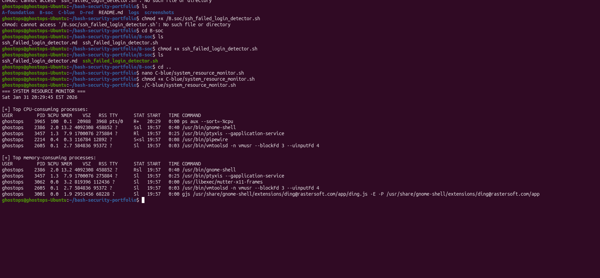

# Bash Security Automation Portfolio

## Overview
This repository showcases practical Bash scripting for cybersecurity roles, with a focus on **SOC operations**, **blue team monitoring**, and **ethical reconnaissance automation**.

All scripts were developed and executed in a controlled lab environment and are intended **strictly for educational and defensive security purposes**.

---

## Environment
- **Host OS:** Ubuntu Linux (VMware Fusion)
- **Recon / Attack VM:** Kali Linux (ethical use only)
- **Shell:** Bash
- **Version Control:** Git & GitHub

---

## Repository Structure

bash-security-portfolio/
├── A-foundation/ # Bash fundamentals & environment validation
├── B-soc/ # SOC detection & alerting scripts
├── C-blue/ # Blue team monitoring & system visibility
├── D-red/ # Ethical reconnaissance automation
├── logs/ # Sample or generated logs
├── screenshots/ # Execution proof & evidence
└── README.md

Each directory represents a progressive cybersecurity skill focus, moving from fundamentals to analyst-level automation.

---

## Featured Projects

### B-soc — SOC Detection Automation
**SSH Failed Login Detection**
- Detects repeated failed SSH login attempts
- Threshold-based alerting to identify brute-force attacks
- MITRE ATT&CK mapping: **T1110 – Brute Force**

 Includes:
- Bash script
- High-level documentation
- Line-by-line explanation for interview preparation

📸 Screenshot: `screenshots/07-ssh-failed-login-detection.png`

---

### C-blue — Blue Team Monitoring
**System Resource Monitor**
- Displays top CPU- and memory-consuming processes
- Useful for detecting abnormal resource usage or early compromise indicators

📸 Screenshot: `screenshots/10-system-resource-monitor.png`

---

### D-red — Ethical Reconnaissance Automation
**Basic Recon Script**
- DNS record enumeration
- HTTP header inspection
- Uses read-only, non-intrusive techniques only

Emphasizes ethical boundaries and safe reconnaissance practices

📸 Screenshot: `screenshots/20-basic-recon.png`

---

## Methodology
Each script in this repository follows a consistent methodology:
1. Clear purpose and security use case
2. Ethical considerations
3. Execution logic and output
4. Screenshot evidence
5. Detailed explanation for interview readiness

---

## Disclaimer
All content in this repository is provided **for educational and defensive security purposes only**.  
No scripts are intended for unauthorized access, exploitation, or malicious activity.

---

## Author
**Solomon James**  
Cybersecurity Analyst | SOC • Blue Team • Automation  
linkedin: www.linkedin.com/in/solomon-james-cyber
GitHub: https://github.com/Jaysolex
